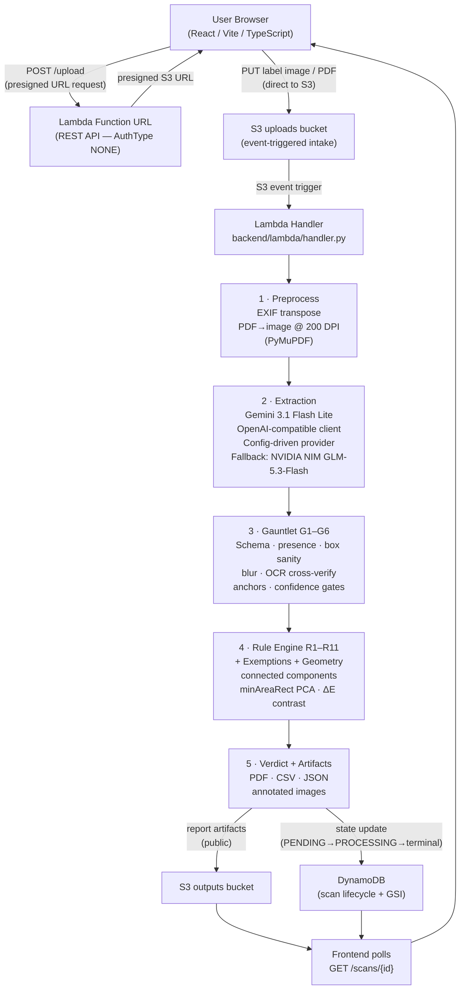

<div align="center">

# LabelProof

### LMPC 2011 label compliance in ~40 seconds — photograph a product label, get a legally-cited compliance verdict with a full report.

[](https://www.python.org/)
[](https://aws.amazon.com/lambda/)
[](./LICENSE)
[](./backend/tests)

**Built for the WeMakeDevs × AWS Bharat Builds Tour "First Commit" hackathon (Ship It track) and SIH 2026 (PS SIH26034, Ministry of Consumer Affairs)**

[**Live Demo**](<PLACEHOLDER — S3 website URL>) · [**API**](https://owda7ujf7yynpwthu4ecbrtqhy0wxwlu.lambda-url.ap-south-1.on.aws/) · [**Contracts**](./CONTRACTS.md) · [**Decisions**](./DECISIONS.md)

---

<!-- PLACEHOLDER: Add a short screen recording GIF or screenshot here -->
<!-- Example:  -->

</div>

---

## Table of Contents

- [The Problem](#the-problem)
- [Core Safety Design](#core-safety-design-the-soul-of-the-product)
- [How It Works](#how-it-works)
- [The 11 Compliance Rules](#the-11-compliance-rules)
- [Architecture](#architecture)
- [AWS Services](#aws-services)
- [Tech Stack](#tech-stack)
- [Project Structure](#project-structure)
- [Quick Start](#quick-start)
- [AWS Feedback](#aws-feedback-honest)
- [Engineering Process](#engineering-process)
- [Team](#team)
- [Limitations & Roadmap](#limitations--roadmap)
- [License](#license)

---

## The Problem

Every pre-packaged product sold in India must carry **11 mandatory declarations** under the Legal Metrology (Packaged Commodities) Rules, 2011. Compliance verification today is manual — inspector with rulebook, eyeballing a label — which is:

- **Slow**: a multi-SKU audit takes hours
- **Error-prone**: geometric checks (numeral heights, clear space, contrast) are near-impossible to do visually and consistently
- **Unscalable**: sellers cannot self-audit before committing to a print run of lakhs of labels; inspectors cannot scan thousands of SKUs at market speed

LabelProof automates the full 11-point checklist, including the *geometric* sub-rules that no prior tool touches, and returns a structured verdict in ~40 seconds.

---

## Core Safety Design: The Soul of the Product

> **"Never a silent wrong verdict."**

A system that says *COMPLIANT* on a bad label is worse than no system at all. Every design decision in LabelProof traces back to one constraint: **ambiguous or unreadable data degrades to `NEEDS_REVIEW` for human review — it never silently produces a wrong verdict.**

### Anti-Hallucination by Construction

The LLM is the reader, not the judge. Its output passes a **six-gate verification gauntlet** before any verdict is issued:

| Gate | What it checks |
|------|----------------|
| **G0** | JSON schema validation — malformed output is rejected immediately |
| **G1** | Mandatory field presence — every required field must be populated |
| **G2** | Bounding-box sanity — coordinates must be plausible for the image dimensions |
| **G3** | Blur / readability — severely blurred regions are flagged before OCR is attempted |
| **G4** | OCR cross-verification — Tesseract crops each LLM-reported bounding box and verifies the extracted text against the LLM claim (normalized edit-distance = 0) |
| **G5** | Anchor verification — key declarations are independently re-located |
| **G6** | Per-field confidence gates (≥ 0.60) — low-confidence fields resolve to `NA` with a reason code, not to a verdict |

Provider fallback is also baked in at the infrastructure level (see [Architecture](#architecture)).

### Statistical Geometry Verdicts

Geometric checks (numeral height, clear space, contrast) use a **3σ rule** (σ = 0.05 × measured height):

- `FAIL` only when a measurement is **confidently out of spec** (beyond 3σ below the minimum)
- `PASS` only when **confidently within spec** (beyond 3σ above the minimum)
- `NEEDS_REVIEW` for everything in between

This means measurement uncertainty is propagated through the verdict, not hidden.

---

## How It Works

```
User uploads label photo (or PDF) + physical label width (mm)
      │
      ▼
1. PREPROCESS   — EXIF auto-rotate, PDF page-1 render @ 200 DPI (PyMuPDF)
      │
      ▼
2. EXTRACTION   — Multimodal LLM reads the label (Gemini 3.1 Flash Lite,
                  OpenAI-compatible client, config-driven provider)
      │
      ▼
3. GAUNTLET     — G0 schema → G1 presence → G2 box sanity → G3 blur →
                  G4 Tesseract OCR crop-verify → G5 anchors → G6 confidence
      │
      ▼
4. RULE ENGINE  — R1–R11 checks + automatic small-pack exemptions +
                  geometric analysis (connected components, minAreaRect PCA,
                  ΔE contrast)
      │
      ▼
5. VERDICT + ARTIFACTS
      │
      ├── Overall: COMPLIANT / NON_COMPLIANT / NEEDS_REVIEW
      ├── 11-point report with legal citations, evidence, suggested fixes
      ├── PDF report (reportlab)
      ├── CSV + JSON data artifacts
      └── Annotated & display images
```

---

## The 11 Compliance Rules

All rules codify the **Legal Metrology (Packaged Commodities) Rules, 2011**. Small packs (≤ 10 g or > 25 kg) receive automatic `NA_EXEMPT` verdicts with the statutory citation.

| Rule | Declaration | Statutory Reference |
|------|-------------|---------------------|
| R1 | Manufacturer/packer name + complete address | Rule 6(1)(a), 10(1) |
| R2 | Common/generic name of commodity | Rule 6(1)(b) |
| R3 | Net quantity in correct unit | Rule 6(1)(c), 13 |
| R4 | Month & year of manufacture | Rule 6(1)(d) |
| R5 | MRP with prescribed wording | Rule 2(m), 6(1)(e) |
| R6 | Consumer care details | Rule 6(2) |
| R7 | Declarations in Hindi (Devanagari) or English | Rule 9(4) |
| R8 | Minimum numeral height (PDP-area based, GSR 629(E)) | Rule 7(2), 7(3) |
| R9 | Clear space around quantity declaration | Rule 8 |
| R10 | Contrast of MRP/quantity numerals | Rule 9(1)(b) |
| R11 | No misleading quantity qualifiers | Rule 12(6) |

Every `NA` and `NEEDS_REVIEW` verdict carries one of **9 reason codes** plus a human-readable message and a suggested action (from `reasons.config`). Every `FAIL` carries a concrete fix.

---

## Architecture



> **Provider agnosticism:** The extraction layer uses a single OpenAI-compatible client interface configured via `backend/config/llm_providers.config`. Switching providers requires zero code changes — the Bedrock → Gemini pivot during development was a config-only operation (see [AWS Feedback](#aws-feedback-honest)).

---

## AWS Services

| Service | Role | Notes |
|---------|------|-------|
| **S3 × 3** | `uploads` (event-triggered intake), `outputs` (public report artifacts), `web` (static frontend hosting) | Event notification on `uploads` triggers the Lambda pipeline |
| **Lambda** | Entire backend: pipeline handler + REST API | Two layers attached: Tesseract OCR (eng + hin traineddata); slimmed Python deps layer (~170 MB unzipped) |
| **DynamoDB** | Scan lifecycle (`PENDING → PROCESSING → terminal`), GSI for scan history | Atomic conditional writes for retry-safety; DynamoDB Streams not used |
| **Lambda Function URL** | Public REST API | `AuthType NONE`; eliminated the need for API Gateway entirely |
| **IAM** | Least-privilege inline policies per resource | — |
| **CloudWatch** | Execution logs + debuggability | — |

> **4 AWS core services: S3, Lambda, DynamoDB, Lambda Function URL.** No API Gateway, no EventBridge/SNS, no Cognito, no Textract in the MVP.

---

## Tech Stack

| Layer | Technology |
|-------|-----------|
| Runtime | Python 3.12 |
| LLM (extraction) | Gemini 3.1 Flash Lite — multimodal, OpenAI-compatible endpoint |
| LLM fallback | NVIDIA NIM GLM-5.3-Flash (configured as secondary provider) |
| OCR | Tesseract (eng + hin traineddata) |
| PDF rendering | PyMuPDF |
| Geometry / image | scipy · numpy · Pillow · OpenBLAS |
| Report generation | reportlab (deterministic / invariant mode) |
| AWS SDK | boto3 |
| Frontend | React 19 · Vite 8 · TypeScript · react-router-dom |
| Frontend hosting | S3 static website |

---

## Project Structure

```
LabelProof/
├── CONTRACTS.md              ← Frozen API contract (backend + frontend build against this)
├── DECISIONS.md              ← Constitution — read before anything else
├── AGENTS.md                 ← Rules for every AI agent and contributor
├── TASKS.md / PROGRESS.md    ← Work queue + live state
│
├── backend/
│   ├── lambda/
│   │   └── handler.py        ← Lambda entry point
│   ├── src/
│   │   ├── preprocess/       ← EXIF transpose, PDF render
│   │   ├── extraction/       ← LLM client (provider-agnostic)
│   │   ├── gauntlet/         ← Gates G1–G6
│   │   ├── rules/            ← Checks R1–R11, engine, verdict, exemptions
│   │   ├── geometry/         ← Connected components, PCA, ΔE contrast
│   │   ├── reports/          ← PDF / CSV / JSON / image artifact generation
│   │   ├── ingestion/        ← S3 event intake and presign API
│   │   ├── api/              ← REST route handlers
│   │   └── pipeline/         ← Orchestrator
│   ├── config/
│   │   ├── llm_providers.config   ← Provider config (Gemini, NVIDIA NIM, Bedrock)
│   │   ├── anchors.config
│   │   ├── reasons.config
│   │   ├── patterns.config
│   │   ├── thresholds.config
│   │   ├── tobacco.config
│   │   ├── ingestion.config
│   │   ├── reports.config
│   │   ├── api.config
│   │   └── benchmark.config
│   ├── infra/
│   │   ├── lambda/           ← deploy_lambda.py (creates role, function, trigger, URL)
│   │   ├── layers/           ← Layer publish scripts
│   │   ├── buckets/          ← S3 setup
│   │   ├── dynamodb/         ← Table + GSI setup
│   │   └── bedrock/          ← Bedrock policy (re-enable via config when available)
│   ├── docs/
│   │   ├── ENGINEERING.md    ← Full feature specs (10 features, all proven)
│   │   ├── ARCHITECTURE.md   ← System map
│   │   └── CHECKS.md         ← Per-check spec (compiled 1:1 from ENGINEERING.md)
│   ├── tests/                ← 186 automated tests
│   ├── fixtures/             ← Golden fixture files
│   └── benchmark/            ← Benchmark runner (framework built)
│
└── frontend/
    ├── src/                  ← React app (builds against CONTRACTS.md only)
    └── vite.config.ts
```

> **Config, not code:** all rule pattern data, thresholds, reason codes, provider settings, and report parameters live in `backend/config/`. Nothing from the spec tables is hardcoded.

---

## Quick Start

### Prerequisites

- Python 3.12
- AWS credentials configured (`~/.aws/credentials`) with access to S3, Lambda, DynamoDB in `ap-south-1`
- A Gemini API key (primary provider)

### Local Development & Testing

```bash
# 1. Clone and set up the virtual environment
git clone <repo-url>
cd LabelProof
python -m venv .venv
.venv\Scripts\activate        # Windows
# source .venv/bin/activate   # Linux/macOS

# 2. Install dependencies
pip install -r backend/requirements.txt   # <PLACEHOLDER — verify exact path>

# 3. Set required environment variables
set GEMINI_API_KEY=<your-key>
set TABLE_NAME=scans
set UPLOADS_BUCKET=<your-uploads-bucket>
set OUTPUTS_BUCKET=<your-outputs-bucket>
set WEB_BUCKET=<your-web-bucket>
set REGION=ap-south-1
set TESSDATA_PREFIX=<path-to-tessdata>

# 4. Run the test suite
pytest                         # full suite: unit + golden fixtures
pytest -k determinism          # two-run identity assertion

# 5. Run a live one-shot provider verification
python <PLACEHOLDER — path to live verification script>
```

### Deploy to AWS

```bash
# Publish Lambda layers (Tesseract OCR + Python deps)
python backend/infra/layers/<PLACEHOLDER — layer publish script>

# Deploy the Lambda function (creates role, function, S3 trigger, Function URL)
python backend/infra/lambda/deploy_lambda.py

# Deploy frontend
cd frontend
npm install
npm run build
# Sync dist/ to S3 web bucket (see infra/buckets/)
```

### Environment Variables Reference

| Variable | Description | Example |
|----------|-------------|---------|
| `GEMINI_API_KEY` | Primary LLM provider key | `AIza...` |
| `TABLE_NAME` | DynamoDB table name | `scans` |
| `UPLOADS_BUCKET` | S3 bucket for label uploads | `labelproof-uploads-...` |
| `OUTPUTS_BUCKET` | S3 bucket for report artifacts | `labelproof-outputs-...` |
| `WEB_BUCKET` | S3 bucket for static frontend | `labelproof-web-...` |
| `REGION` | AWS region | `ap-south-1` |
| `TESSDATA_PREFIX` | Path to Tesseract traineddata | `/opt/tessdata` |

---

## AWS Feedback (Honest)

This section responds to the hackathon's explicit ask for honest AWS platform feedback.

### What Worked Flawlessly

- **S3 event-driven intake** — zero configuration headaches; the `s3:ObjectCreated` trigger to Lambda was instant and reliable throughout development and live burn-in.
- **Lambda layers** — packaging Tesseract + traineddata as a separate layer kept the deployment workflow clean and the function zip small.
- **DynamoDB conditional writes** — `ConditionExpression` for state-machine transitions (e.g., `attribute_not_exists` / `status = PENDING`) worked exactly as documented; no retry races in production.
- **Lambda Function URL** — exposing a public REST API with `AuthType NONE` required zero additional service configuration. API Gateway was never needed.

### Friction 1 — Bedrock Model Access in ap-south-1

Amazon Bedrock model access in `ap-south-1` surfaced a `ValidationException` due to the distinction between base model IDs and cross-region inference profile ARNs. Because the extraction layer was built **provider-agnostic from day zero** — single OpenAI-compatible client, config-driven providers, G0 schema validation upstream of the provider call — we switched to Gemini via its OpenAI-compatible endpoint with **zero code changes**. The NVIDIA NIM fallback was configured as the secondary provider in the same operation. Bedrock can be re-enabled as a single config row (`backend/config/llm_providers.config`) plus a small dialect adapter when access is confirmed in-region.

### Friction 2 — Lambda Layer 250 MB Unzipped Limit

The `scipy + numpy + PyMuPDF + Pillow` stack exceeded the 250 MB unzipped limit (code + all layers combined). We pruned `scipy` to only the sub-packages the geometry code imports (`ndimage`, `special`, `linalg`) and removed the implicit `OpenBLAS` full distribution, saving ~100 MB. The dependency graph is now documented so future additions can be evaluated against the budget before adding them.

---

## Engineering Process

### Spec-First Development

Every module was fully specified and peer-reviewed before any code was written. The frozen data contract ([`CONTRACTS.md`](./CONTRACTS.md)) was established at the start of the project and drove backend and frontend development **in parallel with zero integration surprises** — the frontend built against the contract document, not against backend code.

### Adversarial Cross-Model Review

An independent model reviewed the build in scenario mode: wrong-verdict construction attacks, contract diffs, failure-path audits, and edge-case enumeration. **20+ findings** were triaged and fixed before the live deployment.

### Test Coverage

- **186 automated tests**, all green
- **Deterministic pipeline**: identical inputs produce byte-identical reports across runs (replay-verified via `pytest -k determinism`)
- Fixture schemas validated on load — a fixture that does not match `CONTRACTS.md` fails loudly

### Live Validation

The pipeline was burn-in validated against a real label dataset before deployment.

---

## Team

| Member | Role | Contributions |
|--------|------|---------------|
| \<NAME 1\> | Backend & Architecture | Designed the serverless compliance pipeline — LLM extraction, OCR verification gauntlet, rule engine and geometry analysis — and owned the API layer and end-to-end integration |
| \<NAME 2\> | AWS Infrastructure & DevOps | Built and maintained the AWS deployment — Lambda layers, S3/DynamoDB setup, IAM policies and the live production environment |
| \<NAME 3\> | Frontend — UI & Experience | Owned the complete product interface — upload, scanning and results experience, visual design, and the report-viewing screens users actually see |
| \<NAME 4\> | Frontend — Contracts & Integration | Owned all API integration from the frozen `CONTRACTS.md` — upload/presign flow, polling, pagination and artifact delivery — and isolated & reported production endpoint issues during integration |

---

## Limitations & Roadmap

### Current Limitations

| Area | Status |
|------|--------|
| Benchmark accuracy numbers | Framework built; corpus collection and calibration is the next step. **No accuracy percentage is claimed.** |
| Non-upright label photos | Auto-orientation not yet implemented; safely degrades to `NEEDS_REVIEW` |
| Dot-matrix stamped dates | Hard for OCR to read reliably; flagged as `NEEDS_REVIEW`, never guessed |
| Free-tier LLM rate limits | Mitigated by the provider fallback chain; a paid tier removes this entirely |

### Roadmap

- [ ] Benchmark calibration on a collected label corpus (the framework is production-ready)
- [ ] Auto-orientation for non-upright label photos
- [ ] Bedrock re-enable (config + dialect adapter when in-region access is confirmed)
- [ ] Mobile capture UX (optimized camera upload flow)
- [ ] Batch scan support (multiple SKUs in one submission)

---

## Key Documents

| Document | Purpose |
|----------|---------|
| [`DECISIONS.md`](./DECISIONS.md) | The constitution — every locked decision lives here |
| [`CONTRACTS.md`](./CONTRACTS.md) | Frozen API contract — the only shared frontend/backend document |
| [`AGENTS.md`](./AGENTS.md) | Rules for every AI agent and human contributor |
| [`backend/docs/ENGINEERING.md`](./backend/docs/ENGINEERING.md) | Full feature specs (10 features, all proven) |
| [`backend/docs/CHECKS.md`](./backend/docs/CHECKS.md) | Per-check spec, compiled 1:1 from ENGINEERING.md |
| [`PROGRESS.md`](./PROGRESS.md) | Live implementation state |
| [`TASKS.md`](./TASKS.md) | Work queue |

---

## License

This project is licensed under the MIT License — see the [`LICENSE`](./LICENSE) file for details.

---

<div align="center">

**LabelProof** · LMPC 2011 Compliance Automation · AWS · ap-south-1

*Built at the WeMakeDevs × AWS Bharat Builds Tour "First Commit" Hackathon, September 2026*

</div>
